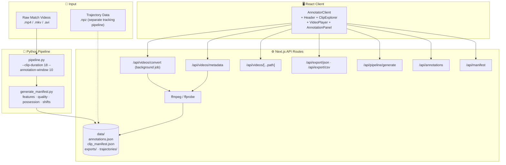

<div align="center">

<!-- ANIMATED HEADER -->


<!-- LANGUAGE TOGGLE -->

[ 🇬🇧 English ](README.md) | [ 🇯🇵 日本語 ](README_JP.md)

<br/>

<!-- BADGES -->

[](https://nextjs.org/)
[](https://react.dev/)
[](https://www.typescriptlang.org/)
[](https://python.org/)
[](https://ffmpeg.org/)
[](https://tailwindcss.com/)
[](LICENSE)

<br/>

[](https://github.com/shafayatsaad)
[](https://www.linkedin.com/in/shafayatsaad/)
[](https://shafayatsaad.vercel.app/)

<br/>

<p>
  <b>TACTIC-FP Annotator</b> is a production-grade, keyboard-first web platform for labelling football (soccer) tactical intent at the clip level. It produces clean, benchmark-ready datasets for the <b>TACTIC-Bench</b> research framework — with live video streaming, team-aware possession logic, automatic segment creation, and one-click export.
</p>

</div>

---

## 📋 Table of Contents

- [🎯 Overview](#-overview)
- [✨ Key Features](#-key-features)
- [🏗️ Architecture](#️-architecture)
- [🛠️ Tech Stack](#️-tech-stack)
- [⚡ Getting Started](#-getting-started)
- [📁 Project Structure](#-project-structure)
- [🔌 API Reference](#-api-reference)
- [⌨️ Keyboard Shortcuts](#️-keyboard-shortcuts)
- [🏷️ TACTIC Intents Reference](#️-tactic-intents-reference)
- [🧬 Pipeline & Data Workflow](#-pipeline--data-workflow)
- [📐 Annotation Schema](#-annotation-schema)
- [📤 Export Formats](#-export-formats)
- [🐞 Troubleshooting](#-troubleshooting)
- [🗺️ Roadmap](#️-roadmap)
- [👥 Maintainer](#-maintainer)

---

## 🎯 Overview

**TACTIC-FP Annotator** is a modern, full-stack web application for annotating football tactical intent at the **clip level**. Purpose-built for the **TACTIC-FP / TACTIC-Bench** research framework, it delivers a fast, distraction-free, single-screen annotation experience.

### Why TACTIC-FP Annotator?

| 🎬  | **Video-first**       | Native HTML5 streaming with range-request seeking, mute, loop, speed control, and fullscreen.                                          |
| :-: | :-------------------- | :------------------------------------------------------------------------------------------------------------------------------------- |
| ⌨️  | **Keyboard-driven**   | Every action — intents, navigation, segment creation, submit — has a single-key shortcut.                                              |
| 🤖  | **Auto-segmentation** | Press **O** at any playhead position to instantly create a timed segment. Segments > 15 s are auto-split; segments < 2 s are rejected. |
| 🧠  | **Possession-aware**  | Attack intents are disabled for the team without the ball; contested possession is flagged automatically. Manual override available.   |
| 📤  | **Research-ready**    | JSON and CSV export in TACTIC-Bench schema, saved server-side and downloaded to the browser.                                           |

---

## ✨ Key Features

### 🎬 Annotation Workflow

- **3-pane layout** — Clip Explorer (left) · Video + Intent Grid (center) · Annotation Panel (right)
- **Continuous segment creation** — video plays from the last segment end; press **O** to mark the current position as the end of the new segment
- **Auto-split** — segments longer than 15 s are automatically split into 15 s chunks with the same tactical label; segments shorter than 2 s are rejected
- **Manual possession override** — Team A / B / Contested / Auto-follow with live UI feedback
- **Quality gate** — submits blocked unless total tracked players ≥ 18, missing trackers ≤ 3, coverage estimate ≥ 80%, and clip quality score ≥ 0.8
- **Forced breaks** every 20 clips and a 50-annotation session cap to maintain annotator accuracy; configurable

### 🎥 Video Player

- Native `<video>` with custom overlay controls
- **MKV → MP4 conversion** via `ffmpeg` with a live progress bar (runs in the background — no timeout)
- **Real video duration** read via `ffprobe` on load — timeline always shows the correct length, not 90 min
- Range-request streaming for instant seek on large files
- Drag-and-drop video loading

### 📊 Pipeline & Data

- `pipeline.py` generates contiguous clip windows from `raw_videos/`, writes `data/clip_manifest.json`
- Trajectory `.npz` files (shape `[T, 23, 4]`) are produced by a **separate** player-tracking pipeline (YOLO + Deep-EIoU) and stored in `data/trajectories/<match_id>/`
- One-click manifest generation from the UI
- Per-clip: quality score, tracking coverage, possession heuristics, anchor events, half detection

---

## 🏗️ Architecture



---

## 🛠️ Tech Stack

| Layer              | Technology                           | Version |
| :----------------- | :----------------------------------- | :------ |
| Frontend framework | Next.js (App Router)                 | 14.2.x  |
| UI library         | React + React DOM                    | 18.3.x  |
| Language           | TypeScript                           | 5.4.x   |
| Styling            | Tailwind CSS + PostCSS               | 3.4.x   |
| Icons              | lucide-react                         | 0.400+  |
| Motion             | framer-motion                        | 11.x    |
| Backend runtime    | Next.js Route Handlers (Node.js)     | –       |
| Pipeline           | Python 3.10+ · OpenCV · NumPy        | –       |
| Video tooling      | `ffmpeg` + `ffprobe` (system binary) | 4.4+    |
| Linting            | ESLint + eslint-config-next          | 8.57.x  |

---

## ⚡ Getting Started

### 1. Prerequisites

> Install all tools **before** running the app. The Next.js server itself only requires Node.js, but video conversion and the pipeline additionally require Python, ffmpeg, and ffprobe.

| Tool              | Min Version | Purpose                                               |
| :---------------- | :---------- | :---------------------------------------------------- |
| **Node.js**       | 18.17 LTS   | Next.js dev server, build, lint                       |
| **npm**           | 9+          | Dependency management                                 |
| **Python**        | 3.10+       | `pipeline.py`, `generate_manifest.py`                 |
| **ffmpeg**        | 4.4+        | MKV → MP4 conversion (background)                     |
| **ffprobe**       | 4.4+        | Video duration / metadata probe (bundled with ffmpeg) |
| **opencv-python** | latest      | Pipeline reads video metadata                         |
| **NumPy**         | latest      | Trajectory `.npz` generation                          |

---

#### 📦 Installing Node.js

```bash
# macOS (Homebrew)
brew install node

# Windows (winget)
winget install OpenJS.NodeJS.LTS

# Ubuntu / Debian
curl -fsSL https://deb.nodesource.com/setup_20.x | sudo -E bash -
sudo apt-get install -y nodejs
```

Verify: `node --version` and `npm --version`

---

#### 🎞️ Installing FFmpeg (includes ffprobe)

> **ffprobe** is bundled with every ffmpeg distribution — no separate install needed.

| OS                  | Command                                                                                                                                     |
| :------------------ | :------------------------------------------------------------------------------------------------------------------------------------------ |
| **Windows**         | `winget install Gyan.FFmpeg` — or download from [gyan.dev/ffmpeg/builds](https://www.gyan.dev/ffmpeg/builds/) and add `bin/` to your `PATH` |
| **macOS**           | `brew install ffmpeg`                                                                                                                       |
| **Ubuntu / Debian** | `sudo apt update && sudo apt install -y ffmpeg`                                                                                             |
| **Fedora**          | `sudo dnf install -y ffmpeg`                                                                                                                |
| **Arch Linux**      | `sudo pacman -S ffmpeg`                                                                                                                     |

Verify installation:

```bash
ffmpeg -version   # Should print build info
ffprobe -version  # Should print the same build info
```

> ⚠️ **Windows PATH tip:** After installing via winget or the manual download, open a **new** terminal window so the updated PATH takes effect. If `ffmpeg` is still not found, add the `bin/` folder of the ffmpeg download to your System Environment Variables manually.

---

#### 🐍 Installing Python & Dependencies

```bash
# Install Python 3.10+ from https://python.org or via your package manager
python --version   # Should print 3.10 or higher

# Install pipeline dependencies (one-time)
pip install numpy opencv-python
```

---

### 2. Clone & Install

```bash
# Clone the repository
git clone https://github.com/shafayatsaad/TACTIC_FP-Annotator.git
cd TACTIC_FP-Annotator

# Install Node.js dependencies
npm install
```

---

### 3. Add Raw Match Videos

Drop your match videos into `raw_videos/`. Supported formats: `.mp4`, `.mkv`, `.avi`, `.mov`, `.webm`.

```
raw_videos/
├── match_01.mp4
├── match_02.mkv   ← Will prompt for MP4 conversion in the UI
└── match_03.mp4
```

> **MKV files:** The app will show a "Prepare MP4" button the first time you open an MKV clip. Click it — ffmpeg converts in the background and a live progress bar shows conversion status. The original `.mkv` is preserved.

---

### 4. Generate the Clip Manifest

**Option A — from the UI:** Open the app → left sidebar → click **Generate Manifest**.

**Option B — from the API:**

```bash
curl -X POST http://localhost:3001/api/pipeline/generate \
  -H "Content-Type: application/json" \
  -d '{"clip_duration": 18, "annotation_window": 10, "step_duration": 10}'
```

**Option C — Python CLI:**

```bash
python pipeline.py --input-dir raw_videos --clip-duration 18 --annotation-window 10 --step-duration 10
```

---

### 5. Start the Dev Server

```bash
npm run dev
```

Then open the URL printed in the terminal (usually **http://localhost:3000** or **http://localhost:3001** if port 3000 is taken).

---

### 6. Annotate!

The workflow is entirely keyboard-driven:

1. **Video plays** automatically from the end of the last segment (or from `0:00` on first load)
2. **Press `O`** — marks the current playhead as the end of a new segment (auto-creates it instantly)
3. **Press `A` / `B`** — switch active team
4. **Press hotkeys** (`1`–`9`, `0`, `Q`, `W`, `R`, `T`) — pick tactical intents for each team
5. **Press `Enter`** — submit the annotation and advance to the next segment

---

### 7. Build for Production

```bash
npm run build
npm run start
```

### 8. Lint

```bash
npm run lint
```

### 9. Reset Session

Use **Reset Session** in the right panel, or via API:

```bash
curl -X POST http://localhost:3001/api/annotations/reset
```

This clears `data/annotations.json`, `data/clip_manifest.json`, exports, and converted MP4s. **Raw videos are never deleted.**

---

## 📁 Project Structure

```text
TACTIC_FP-Annotator/
├── package.json
├── pipeline.py                   # Main Python pipeline: raw_videos → manifest + .npz
├── generate_manifest.py          # Heuristic helpers (features, quality, possession, shifts)
├── pipeline_validator.py         # Optional manifest validation
├── README.md                     # ← you are here
├── README_JP.md                  # 日本語版
├── raw_videos/                   # Drop your .mp4 / .mkv files here
├── data/                         # Auto-created on first run
│   ├── clip_manifest.json
│   ├── annotations.json
│   ├── segments.json
│   ├── exports/
│   └── trajectories/<match_id>/*.npz
└── src/
    ├── app/
    │   ├── layout.tsx
    │   ├── page.tsx
    │   ├── globals.css
    │   └── api/
    │       ├── manifest/route.ts
    │       ├── segments/route.ts
    │       ├── annotations/route.ts
    │       ├── annotations/reset/route.ts
    │       ├── pipeline/generate/route.ts
    │       ├── videos/[[...path]]/route.ts   # Range-aware streaming
    │       ├── videos/convert/route.ts       # Background ffmpeg job + polling
    │       ├── videos/metadata/route.ts      # ffprobe duration probe
    │       ├── export/json/route.ts
    │       └── export/csv/route.ts
    ├── components/
    │   ├── AnnotatorClient.tsx   # All state, keyboard handlers, persistence
    │   ├── Header.tsx
    │   ├── ClipExplorer.tsx
    │   ├── VideoPlayer.tsx       # Video + controls + progress bar
    │   ├── IntentLabels.tsx
    │   └── AnnotationPanel.tsx
    └── lib/
        ├── constants.ts          # TACTIC_INTENTS, HOTKEY_MAP, Clip/Annotation types
        ├── utils.ts              # formatTime, formatMatchClock, normalizeClip
        └── server-utils.ts       # File I/O helpers for API routes
```

---

## 🔌 API Reference

| Method | Route                    | Purpose                                       | Body                                                                             |
| :----- | :----------------------- | :-------------------------------------------- | :------------------------------------------------------------------------------- |
| `GET`  | `/api/manifest`          | Read `data/clip_manifest.json`                | –                                                                                |
| `GET`  | `/api/segments`          | Read `data/segments.json` (user segments)     | –                                                                                |
| `POST` | `/api/segments`          | Save a new segment                            | `Clip`                                                                           |
| `GET`  | `/api/annotations`       | Read current annotation session               | –                                                                                |
| `POST` | `/api/annotations`       | Save / replace annotation session             | `{ annotations, team_config }`                                                   |
| `POST` | `/api/annotations/reset` | Clear session                                 | –                                                                                |
| `POST` | `/api/pipeline/generate` | Run `pipeline.py`                             | `{ clip_duration, annotation_window, step_duration }`                            |
| `GET`  | `/api/videos/list`       | List files in `raw_videos/`                   | –                                                                                |
| `GET`  | `/api/videos/[...path]`  | Stream video (HTTP Range)                     | –                                                                                |
| `HEAD` | `/api/videos/[...path]`  | Probe video existence                         | –                                                                                |
| `GET`  | `/api/videos/metadata`   | ffprobe duration + resolution                 | `?path=raw_videos/match.mp4`                                                     |
| `POST` | `/api/videos/convert`    | Start background MKV→MP4 job                  | `{ source: "match.mkv" }` → `{ jobId }`                                          |
| `GET`  | `/api/videos/convert`    | Poll conversion progress                      | `?jobId=xxx` → `{ status, progress, filename }`                                  |
| `POST` | `/api/export/json`       | Write JSON export (annotator or train schema) | `{ annotations, match_config, team_config }` + `?mode=train` for training format |
| `POST` | `/api/export/csv`        | Write CSV export                              | `{ annotations, team_config }`                                                   |

> **Video conversion** runs entirely in the background — the `POST` returns a `jobId` immediately. Poll `GET /api/videos/convert?jobId=xxx` every 2 s for progress (0–100). When `status === "done"`, the converted filename is returned.
>
> **JSON export** supports two modes via the `?mode` query parameter:
>
> - `?mode=annotator` (default) — full annotator schema with team_home/team_away, formations, decisive actions, tactical shift detection
> - `?mode=train` — pruned training schema with quantized timestamps (100 ms grid), orphan-parent removal, temporal gap filling, primary-team-only block

---

## ⌨️ Keyboard Shortcuts

> Shortcuts are suppressed inside `<input>`, `<textarea>`, and `<select>` elements.

### Playback

| Key           | Action            |
| :------------ | :---------------- |
| `Space` / `K` | Play / Pause      |
| `J`           | Seek −10 s        |
| `L`           | Seek +10 s        |
| `←`           | Seek −5 s         |
| `→`           | Seek +5 s         |
| `Shift + ←`   | Seek −1 s         |
| `Shift + →`   | Seek +1 s         |
| `[`           | Previous segment  |
| `]`           | Next segment      |
| `U`           | Toggle mute       |
| `F`           | Toggle fullscreen |

### Segment Creation

| Key   | Action                                                                  |
| :---- | :---------------------------------------------------------------------- |
| `O`   | **Mark end** of current segment at playhead (creates segment instantly) |
| `X`   | Split current segment at playhead                                       |
| `Esc` | Cancel / close help                                                     |

### Annotation

| Key     | Action                      |
| :------ | :-------------------------- |
| `A`     | Switch active team → Team A |
| `B`     | Switch active team → Team B |
| `S`     | Skip clip                   |
| `Enter` | Submit annotation           |
| `?`     | Toggle shortcuts help modal |

### Intent Hotkeys

| Hotkey | Intent          | Group      |
| :----- | :-------------- | :--------- |
| `1`    | BuildUp_Short   | BuildUp    |
| `2`    | BuildUp_Long    | BuildUp    |
| `Q`    | PossCirculation | BuildUp    |
| `3`    | CounterAttack   | Attack     |
| `W`    | DirectAttack    | Attack     |
| `4`    | HighPress       | Press      |
| `5`    | MidBlockPress   | Press      |
| `6`    | LowBlock        | Press      |
| `7`    | AttackingTrans  | Transition |
| `8`    | DefensiveTrans  | Transition |
| `9`    | SetPieceAttack  | SetPiece   |
| `0`    | SetPieceDefend  | SetPiece   |
| `R`    | DeadBall        | Exclusion  |
| `T`    | ContestedPlay   | Exclusion  |

---

## 🏷️ TACTIC Intents Reference

| Group             | Intent          | Hotkey | Tactical Role                                  |
| :---------------- | :-------------- | :----: | :--------------------------------------------- |
| 🟢 **BuildUp**    | BuildUp_Short   |  `1`   | Short-range possession circulation in own half |
| 🟢 **BuildUp**    | BuildUp_Long    |  `2`   | Long-ball progression out of defence           |
| 🟢 **BuildUp**    | PossCirculation |  `Q`   | Patient side-to-side possession                |
| 🟣 **Attack**     | CounterAttack   |  `3`   | Fast transition after winning the ball         |
| 🟣 **Attack**     | DirectAttack    |  `W`   | Direct forward play, minimal midfield          |
| 🔴 **Press**      | HighPress       |  `4`   | Aggressive press in the opponent's half        |
| 🔴 **Press**      | MidBlockPress   |  `5`   | Mid-field press / mid block                    |
| 🔴 **Press**      | LowBlock        |  `6`   | Deep defensive block                           |
| 🟪 **Transition** | AttackingTrans  |  `7`   | Off-ball run / attacking transition            |
| 🟪 **Transition** | DefensiveTrans  |  `8`   | Counter-press / defensive transition           |
| 🩷 **SetPiece**   | SetPieceAttack  |  `9`   | Attacking set-piece (corner, FK, etc.)         |
| 🩷 **SetPiece**   | SetPieceDefend  |  `0`   | Defending a set-piece                          |
| ⚪ **Exclusion**  | DeadBall        |  `R`   | Play stopped (auto-fills both teams)           |
| ⚪ **Exclusion**  | ContestedPlay   |  `T`   | Possession too unclear to label                |

---

## 🧬 Pipeline & Data Workflow

```text
raw_videos/*.mp4
    │
    ▼
pipeline.py ──► data/clip_manifest.json
    │
    ▼
Browser (AnnotatorClient)
    │  [Press O → create segment]
    ▼
data/segments.json + data/annotations.json
    │
    ▼
data/exports/TACTIC_FP_Annotated_<match>.{json,csv}

# Trajectory .npz files (shape [T, 23, 4]) are generated by a
# separate tracking pipeline (YOLO + Deep-EIoU) and placed in
# data/trajectories/<match_id>/ — they are not produced by pipeline.py.
```

### `pipeline.py` CLI flags

| Flag                  | Default      | Notes                              |
| :-------------------- | :----------- | :--------------------------------- |
| `--input-dir`         | `raw_videos` | Folder with source videos          |
| `--clip-duration`     | `30`         | Window length in seconds           |
| `--annotation-window` | `6`          | Central label window (seconds)     |
| `--step-duration`     | `7`          | Step between windows (seconds)     |
| `--no-trajectories`   | off          | _Not implemented — see note above_ |

---

## 📐 Annotation Schema

Every annotation saved by the UI conforms to this shape:

```ts
interface Annotation {
  schema_version: "1.0.0";
  dataset: "TACTIC-Bench";
  clip_id: string;
  match_id: string;
  half: "1st" | "2nd";
  game_state: { half; match_clock_sec; score_home; score_away; dead_ball? };
  video_source: {
    video_path;
    seek_start_sec;
    label_start_sec;
    label_end_sec;
    seek_end_sec;
  };
  segment_metadata: {
    start_sec;
    end_sec;
    duration_sec;
    coverage_estimate;
    is_mixed_phase;
  };
  team_a: { label: { intent_class; confidence; certainty }; possession };
  team_b: {
    /* same shape */
  };
  exclusion: "DeadBall" | "ContestedPlay" | null;
  annotation_meta: {
    annotator_id;
    session_id;
    annotation_timestamp;
    annotation_duration_sec;
  };
  agreement: { flagged_review; skipped };
  model_split: { assigned_split: "train" | "val" | "test" };
}
```

---

## 📤 Export Formats

### JSON — `TACTIC_FP_Annotated_<match>.json`

TACTIC-Bench model-sample shape (one record per segment) with full reconstruction metadata, team labels, and split assignment.

### CSV — `TACTIC_FP_Annotated_<match>.csv`

Flat, spreadsheet-friendly table with one row per annotation. Columns include:

```
clip_id, match_id, half, video_path, seek_start_sec, label_start_sec, label_end_sec,
team_a_intent, team_a_confidence, team_a_possession,
team_b_intent, team_b_confidence, team_b_possession,
exclusion, flagged_review, skipped, annotated_at
```

---

## 🐞 Troubleshooting

| Symptom                                            | Likely Cause                       | Fix                                                                                                                    |
| :------------------------------------------------- | :--------------------------------- | :--------------------------------------------------------------------------------------------------------------------- |
| `ffmpeg not found` when converting MKV             | `ffmpeg` not on `PATH`             | Install via the table above; verify with `ffmpeg -version` in a **new** terminal                                       |
| `ffprobe not found` (timeline shows 90 min)        | `ffprobe` not on `PATH`            | ffprobe ships with ffmpeg — re-install ffmpeg and ensure `bin/` is on `PATH`                                           |
| **Prepare MP4** button does nothing                | ffmpeg not installed or path issue | Run `ffmpeg -version` in terminal; restart the dev server after installing                                             |
| Video shows 90-min timeline for a 45-min file      | ffprobe not available              | Install ffmpeg/ffprobe; the app falls back to `<video>.duration` on `loadedmetadata` which may be slow for large files |
| `EADDRINUSE` on `npm run dev`                      | Port 3000 already in use           | Next.js auto-tries 3001 — check the terminal output for the actual URL                                                 |
| `Error: spawn python3 ENOENT` on Generate Manifest | Python not on `PATH`               | Install Python 3.10+; verify with `python --version` or `python3 --version`                                            |
| MKV won't play in browser                          | Browser doesn't decode MKV         | Click **Prepare MP4** in the player — ffmpeg remuxes the file (no quality loss, fast for most files)                   |
| Conversion progress stuck at 0%                    | ffmpeg is still running but slow   | Large files take time — the bar updates every 2 s. Check the terminal for server output                                |

---

## 🗺️ Roadmap

- [ ] **Multi-match dashboard** — aggregate stats across all annotated matches
- [ ] **Review mode** — side-by-side annotation comparison for inter-rater agreement
- [ ] **Team template library** — save and reuse team configs (jersey colors, names) across sessions
- [ ] **Cloud sync** — optional S3/GCS backend for annotation storage
- [ ] **Model proposals** — display ML-generated label suggestions alongside manual annotation

---

## 👥 Maintainer

<div align="center">
<table>
<tr>
<td align="center">
  <a href="https://github.com/shafayatsaad">
    
    <br/>
    <strong>Shafayat Saad</strong>
  </a>
  <br/>
  <sub>Full-Stack Developer & AI/ML Engineer</sub>
  <br/><br/>
  <a href="https://github.com/shafayatsaad">
    
  </a>
  <a href="https://www.linkedin.com/in/shafayatsaad/">
    
  </a>
  <a href="https://shafayatsaad.vercel.app/">
    
  </a>
</td>
</tr>
</table>
</div>

---

<div align="center">

<!-- FOOTER -->


**Built with ⚽ for the TACTIC-Bench Research Framework**

_A keyboard-first, research-grade football annotation platform._

</div>
