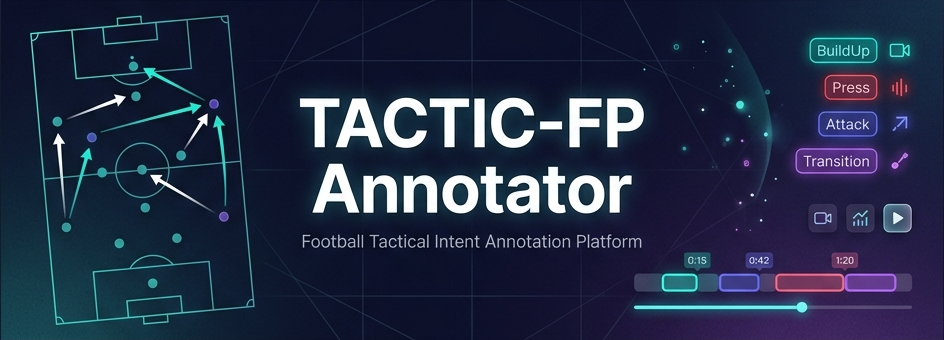

<div align="center">

<!-- BANNER -->


<br/>

<!-- LANGUAGE TOGGLE -->

[ 🇬🇧 English ](README.md) &nbsp;|&nbsp; [ 🇯🇵 日本語 ](README_JP.md)

<br/>

[](https://nextjs.org/)
[](https://react.dev/)
[](https://www.typescriptlang.org/)
[](https://python.org/)
[](https://ffmpeg.org/)
[](https://tailwindcss.com/)

<br/>

<p>
  <b>TACTIC-FP Annotator</b> は、サッカー映像から戦術的意図をクリップ単位でアノテーションするためのローカル Web ツールです。
  動画再生、セグメント作成、チーム別ラベル付け、JSON/CSV エクスポートを 1 つの画面で行えます。
</p>

</div>

---

## 概要

TACTIC-FP Annotator は、TACTIC-FP / TACTIC-Bench 研究ワークフロー向けのアノテーション UI です。研究者や分析者は、試合映像を読み込み、2 秒から 15 秒のセグメントを作成し、各チームの戦術的意図をラベル付けできます。

このリポジトリは主にアノテーションツールとデータ整形用の補助スクリプトを含みます。モデル学習、実トラッキング、NOTEARS、GMM 比較、推論エンジンは別途実装が必要です。

## 主な機能

- Next.js / React / TypeScript によるローカル Web アプリ
- `raw_videos/` の動画読み込みと HTTP Range 対応ストリーミング
- MKV から MP4 への `ffmpeg` 変換
- キーボード中心のセグメント作成とラベル付け
- Team A / Team B の戦術意図ラベル
- `DeadBall` / `ContestedPlay` の除外ラベル
- `data/annotations.json` と `data/segments.json` へのローカル保存
- 学習用 JSON と確認用 CSV のエクスポート

## セットアップ

必要なもの:

- Node.js 18.17 以上
- npm
- Python 3.10 以上
- ffmpeg / ffprobe
- Python パッケージ: `numpy`, `opencv-python`

インストール:

```bash
npm install
pip install numpy opencv-python
```

動画を配置:

```text
raw_videos/
  match_001.mp4
  match_002.mkv
```

開発サーバー:

```bash
npm run dev
```

ブラウザで Next.js が表示した URL を開きます。通常は `http://localhost:3000` です。

## マニフェスト生成

UI の Generate Manifest ボタン、または CLI から生成できます。

```bash
python pipeline.py --input-dir raw_videos --clip-duration 18 --annotation-window 10 --step-duration 10
```

出力:

```text
data/clip_manifest.json
```

注意: `pipeline.py` は動画クリップのマニフェストを作成しますが、実際の `.npz` 追跡テンソルは生成しません。実トラッキングデータは別パイプラインで生成し、`data/trajectories/<match_id>/` に配置してください。

## キーボード操作

再生:

- `Space` / `K`: 再生・一時停止
- `J`: 10 秒戻る
- `L`: 10 秒進む
- `ArrowLeft`: 5 秒戻る
- `ArrowRight`: 5 秒進む
- `U`: ミュート
- `F`: フルスクリーン

セグメント:

- `I`: 現在位置をセグメント開始に設定
- `O`: 現在位置をセグメント終了に設定して作成
- `Enter`: アノテーション送信
- `Esc`: キャンセル

チームとラベル:

- `A`: Team A を選択
- `B`: Team B を選択
- `1`, `2`, `Q`, `3`, `W`, `4`, `5`, `6`, `7`, `8`, `9`, `0`, `R`, `T`: 戦術ラベル

## 戦術ラベル

| グループ | ラベル |
| :--- | :--- |
| BuildUp | `BuildUp_Short`, `BuildUp_Long`, `PossCirculation` |
| Attack | `CounterAttack`, `DirectAttack` |
| Press | `HighPress`, `MidBlockPress`, `LowBlock` |
| Transition | `AttackingTrans`, `DefensiveTrans` |
| SetPiece | `SetPieceAttack`, `SetPieceDefend` |
| Exclusion | `DeadBall`, `ContestedPlay` |

## ディレクトリ構成

```text
TACTIC_FP-Annotator/
├── README.md
├── README_JP.md
├── package.json
├── pipeline.py
├── generate_manifest.py
├── pipeline_validator.py
├── raw_videos/                 # ローカル動画
├── data/                       # 生成データ、アノテーション、エクスポート
├── assets/
│   └── banner.png
├── tools/
│   ├── convert_to_train_schema.py
│   └── emergency_json_repair.py
└── src/
    ├── app/
    │   └── api/
    ├── components/
    └── lib/
```

## 重要ファイル

- `src/components/AnnotatorClient.tsx`: アプリ全体の状態管理、ショートカット、保存、エクスポート
- `src/components/VideoPlayer.tsx`: 動画再生、タイムライン、セグメント操作
- `src/components/AnnotationPanel.tsx`: チーム設定、信頼度、エクスポート、リセット
- `src/lib/constants.ts`: ラベル定義、型、セグメント制約
- `src/lib/server-utils.ts`: `data/` と `raw_videos/` のファイル操作
- `src/app/api/export/json/route.ts`: 学習用 JSON 変換と検証
- `pipeline.py`: 動画から `clip_manifest.json` を生成
- `generate_manifest.py`: 動画メタデータと簡易ヒューリスティック

## エクスポート

JSON:

```text
data/exports/TACTIC_FP_Annotated_<match_id>_TRAIN.json
```

CSV:

```text
data/exports/TACTIC_FP_Annotated_<match_id>.csv
```

学習用 JSON では、タイムスタンプを 100ms グリッドに量子化し、セグメント長、padding mask、NPZ パス、除外ラベルなどの検証を行います。

## 注意事項

- `data/`, `raw_videos/`, `.next/`, `node_modules/` は Git 管理対象外です。
- `PROJECT_REFERENCE.md` はローカル作業用の詳細メモで、GitHub には公開しない設定です。
- 実モデル学習には、実際の追跡テンソル `[T, 23, 4]` が必要です。
- `DeadBall` と `ContestedPlay` は学習用の戦術意図として扱わず、除外データとして処理します。

## ビルド

```bash
npm run lint
npm run build
```

---

<div align="center">

**TACTIC-FP Annotator**

Football tactical intent annotation platform.

</div>
